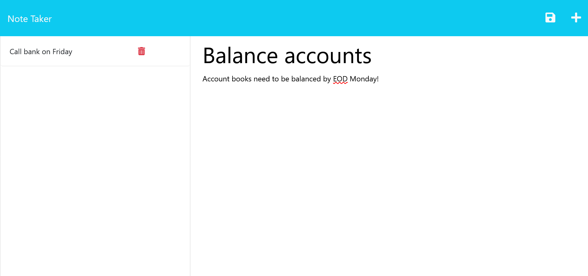
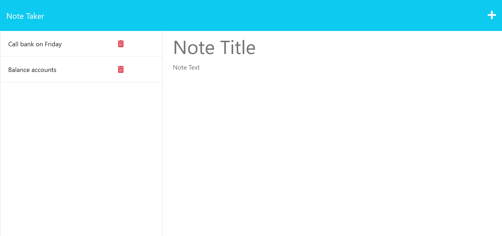

# Note Taker

This app allows one to write and save notes.  It uses an Express.js backend to write and retrieve notes from a JSON file.

## Functionality

The basic logic of the app is as follows:

## Mockup

The following images show the app in use:

## Deployed Application

You can find a live version of the app [here](https://limitless-bastion-53747-30bc20a6077a.herokuapp.com/notes).

## Sources

* The HTML pages, CSS, and frontent were provided by the UCLA coding bootcamp as "starter code"; see the [first commit]() for details.
* Much of the code in server.js (the backend) was repurposed from class activities.
* Many thanks must be given to the class TA, Daniel Stark, for helping me work out an issue with server.js wherein notes were not added to the screen after POST was invoked!

---

Written by Giancarlo Whitaker, 2023